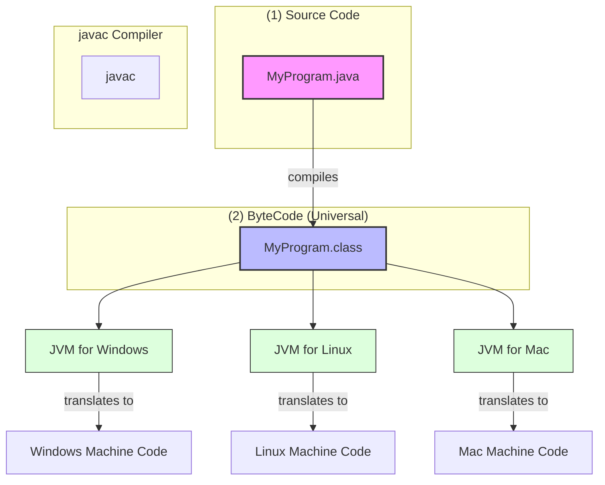

# Java Programming: An Introduction

## 1. What is Java?
* **Definition:** A high-level, class-based, **object-oriented** programming language.
* **Design Philosophy:** Designed to have minimal implementation dependencies.
* **Core Principle:** **"Write Once, Run Anywhere" (WORA)** — Java code can run on any device that supports Java without recompilation.

## 2. History
* **Creator:** James Gosling at **Sun Microsystems** (acquired by Oracle).
* **Year:** Released in **1995**.
* **Naming Evolution:**
    1.  *Oak*
    2.  *Green*
    3.  *Java* (named after the coffee)

## 3. Key Features
* **Object-Oriented:** Everything is modeled as an **Object** (combining data + behavior).
* **Simple:** Eliminates complex features found in C++ (e.g., no explicit pointers).
* **Secure:** Executes inside a virtual sandbox with strict access controls.
* **Robust:** Features strong memory management, including automatic **Garbage Collection**.
* **Multithreaded:** Capable of performing multiple tasks simultaneously.

## 3. Java Platform Independence
* **Why is it independent?**
    * Java does **not** compile directly to machine code (which is specific to hardware like Windows/Linux).
    * Instead, it compiles to a universal intermediate format called **ByteCode**.
* **Mechanism:**
    * This ByteCode is readable by any device running a **Java Virtual Machine (JVM)**.
    * *Analogy:* ByteCode is the "universal language," and the JVM is the "translator" for each specific computer.

## 4. What is ByteCode?
* **Definition:** A highly optimized set of instructions for the JVM.
* **Role:** Acts as the **intermediate language** between source code (`.java`) and machine code.
* **Format:** Stored in **`.class`** files.

## 5. JVM (Java Virtual Machine)
* **Definition:** An abstract computing machine that enables a computer to run Java programs.
* **Function:** acts as the **"Engine"** that reads ByteCode and translates it into specific machine language instructions for the processor.
* **Crucial Distinction:**
    > **Note:** While Java *code* is platform-independent, the **JVM itself is platform-dependent**. You must install a specific JVM version for your OS (Windows, Linux, or Mac).

### 6. Compilation & Execution Flow
